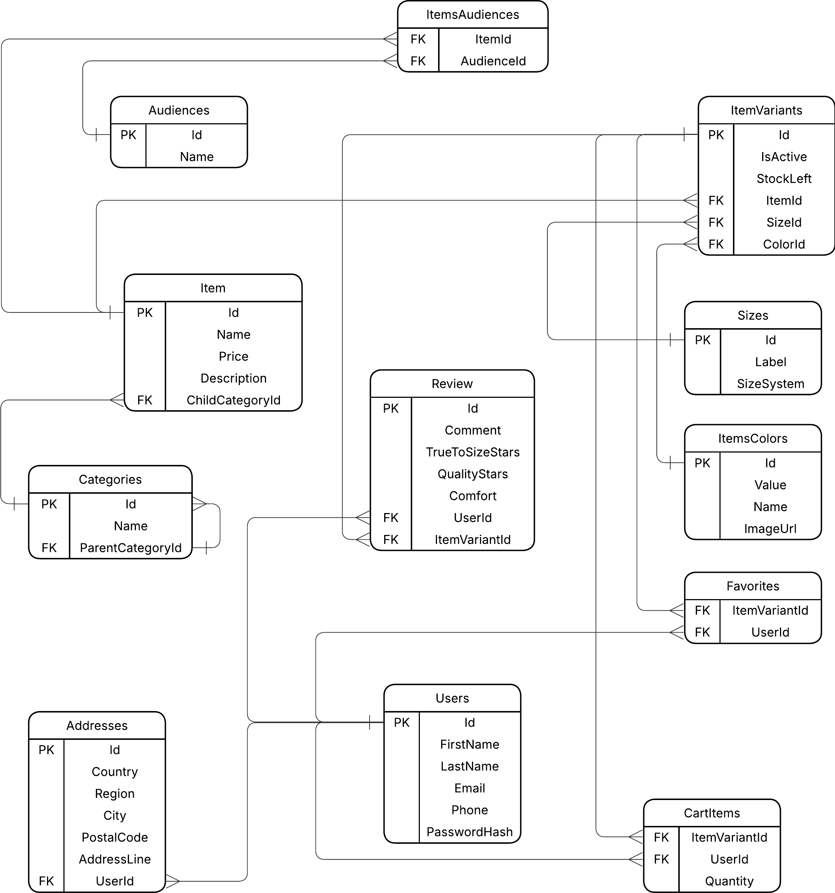

# API Endpoints

### Authentication
| Method | Endpoint       | Description          | Permissions   |
|--------|----------------|----------------------|---------------|
| POST   | /auth/register | Register new user    | Everyone      |
| POST   | /auth/login    | Log in existing user | Everyone      | 
| POST   | /auth/logout   | Logout current user  | User          |
| POST   | /auth/refresh  | Refresh access token | Refresh token |

### User
| Method | Endpoint    | Description                        | Permissions|
|--------|-------------|------------------------------------|------------|
| GET    | /users/me   | Get current user profile data      | User       |
| PATCH  | /users/me   | Update current user profile data   | User       |
| GET    | /users/{id} | Get user profile data with `id`    | Admin      |
| PATCH  | /users/{id} | Update user profile data with `id` | Admin      |
| DELETE | /users/{id} | Remove user with `id`              | Admin      |

### Items
| Method | Endpoint             | Description                                       | Permissions|
|--------|----------------------|---------------------------------------------------|------------|
| GET    | /items               | Get all items                                     | User       |
| POST   | /items               | List new item                                     | Admin      |
| GET    | /items/{id}          | Get info about item with `id`                     | User       |
| PUT    | /items/{id}          | Update item with `id`                             | Admin      |
| DELETE | /items/{id}          | Remove item with `id`                             | Admin      |
| GET    | /items/{id}/variants | Get info about available sizes and colors of item | User       |

### Carts
| Method | Endpoint             | Description                                       | Permissions|
|--------|----------------------|---------------------------------------------------|------------|
| GET    | /cart                | Get current user's cart                           | User       |
| POST   | /cart/items          | Add item to current user's cart                   | User       |
| PUT    | /cart/items/{itemId} | Update the quantity of item with `itemId` in cart | User       |
| DELETE | /cart/items/{itemId} | Delete item with `itemId` from current user's cart| User       |

### Reviews
| Method | Endpoint            | Description                                           | Permissions |
|--------|---------------------|-------------------------------------------------------|-------------|
| GET    | /items/{id}/reviews | Fetch the reviews for the item with `id`              | User        |
| POST   | /items/{id}/reviews | Add a review for the item with `id` from current user | User        |
| PUT    | /reviews/{id}       | Update the review with `id`                           | User        |
| DELETE | /reviews/{id}       | Remove the review with `id`                           | User/Admin  |

### Favorites
| Method | Endpoint                  | Description                                | Permissions|
|--------|---------------------------|--------------------------------------------|------------|
| GET    | /favorites                | Gets the favorite items of the current user| User       |
| POST   | /favorites/items          | Add item to favorites                      | User       |
| DELETE | /favorites/items/{itemId} | Remove item with `itemId` from favorites   | User       |

### Categories
| Method | Endpoint         | Description               | Permissions|
|--------|------------------|---------------------------|------------|
| GET    | /categories      | Get all item categories   | User       |
| POST   | /categories      | Add new category          | Admin      |
| PUT    | /categories/{id} | Update category with `id` | Admin      |
| DELETE | /categories/{id} | Remove category with `id` | Admin      |

### Audiences
| Method | Endpoint        | Description                        | Permissions|
|--------|-----------------|------------------------------------|------------|
| GET    | /audiences      | Get all audience categories        | User       |
| POST   | /audiences      | Create new audience category       | Admin      |
| PUT    | /audiences/{id} | Update audience category with `id` | Admin      |
| DELETE | /audiences/{id} | Remove audience category with `id` | Admin      |

### Sizes
| Method | Endpoint    | Description           | Permissions|
|--------|-------------|-----------------------|------------|
| GET    | /sizes      | Get all item sizes    | User       |
| POST   | /sizes      | Create new size       | Admin      |
| PUT    | /sizes/{id} | Update size with `id` | Admin      |
| DELETE | /sizes/{id} | Remove size with `id` | Admin      |

### Colors
| Method | Endpoint     | Description            | Permissions|
|--------|--------------|------------------------|------------|
| GET    | /colors      | Get all item colors    | User       |
| POST   | /colors      | Create new color       | Admin      |
| PUT    | /colors/{id} | Update color with `id` | Admin      |
| DELETE | /colors/{id} | Remove color with `id` | Admin      |

---

# Query parameters

### GET /items
| Parameter        | Type   | Description               | Required |
|------------------|--------|---------------------------|----------|
| category=`cat`   | String | Filter items by category  | No       |
| search=`query`   | String | Filter items by name      | No       |
| size=`size`      | String | Filter items by size      | No       |
| color=`col`      | String | Filter items by color     | No       |
| audience=`aud`   | String | Filter items by audience  | No       |
| pricemin=`price` | Number | Set lower bound for price | No       |
| pricemax=`price` | Number | Set upper bound for price | No       |
| page=`num`       | Number | Get items on page `num`   | No       |

### GET /items/{id}/reviews
| Parameter     | Type   | Description                                     | Required |
|---------------|--------|-------------------------------------------------|----------|
| stars=`stars` | Number | Get reviews with stars more or equal to `stars` | No       |
| page=`num`    | Number | Get reviews on page `num`                       | No       |

### GET /favorites
| Parameter      | Type   | Description                | Required |
|----------------|--------|----------------------------|----------|
| search=`query` | String | Filter favorites by name   | No       |
| page=`num`     | Number | Get favorites on page `num`| No       |

### GET /cart
| Parameter      | Type   | Description                  | Required |
|----------------|--------|------------------------------|----------|
| search=`query` | String | Filter cart items by name    | No       |
| page=`num`     | Number | Get cart items on page `num` | No       |

